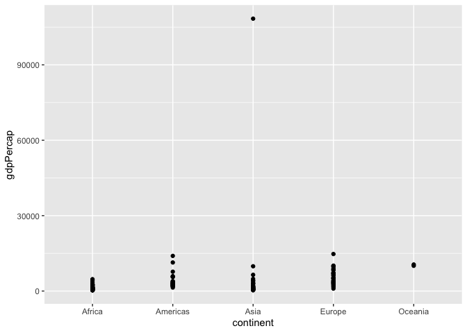
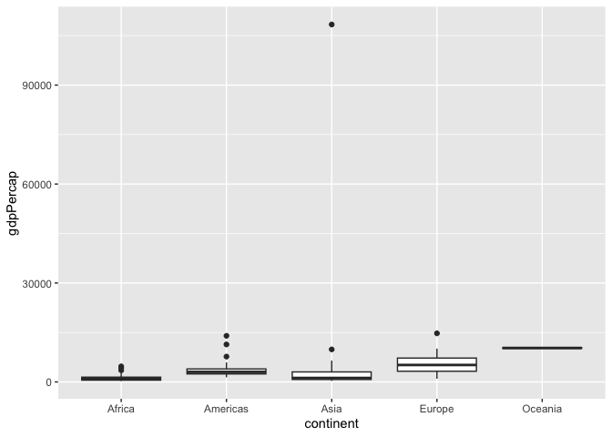
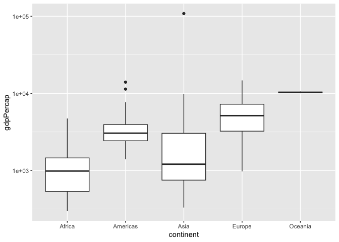
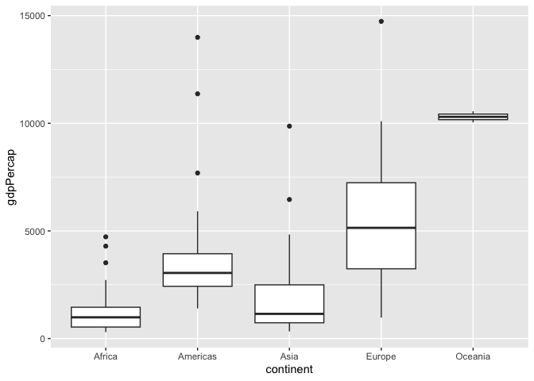
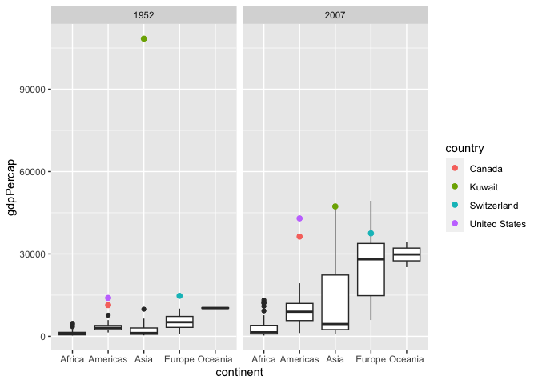
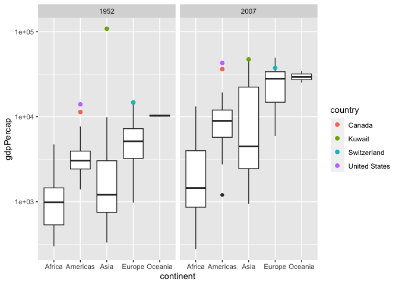
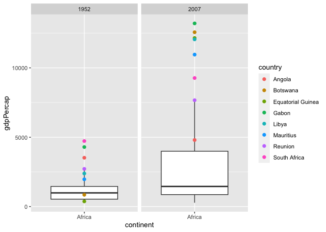
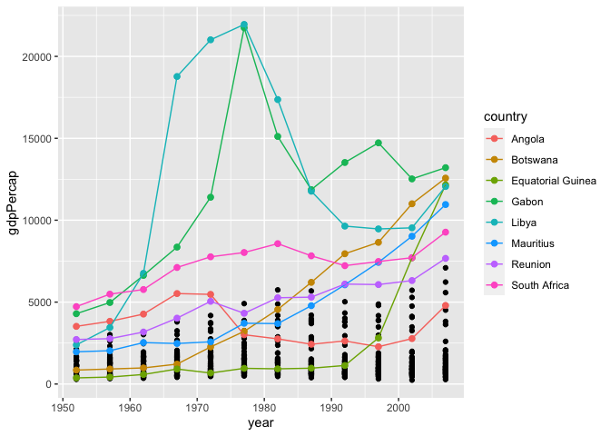
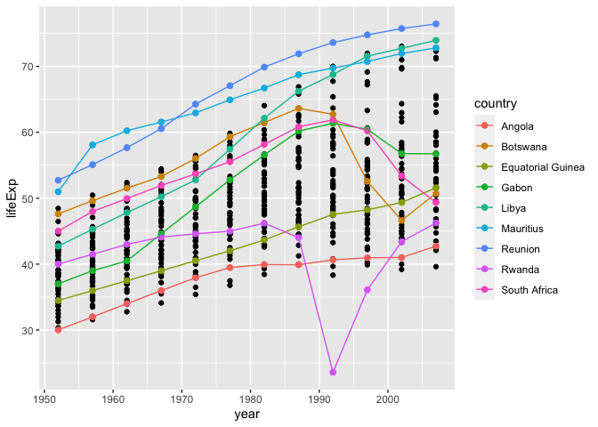

Gapminder
================
An Grocki
2023-02-23

- <a href="#grading-rubric" id="toc-grading-rubric">Grading Rubric</a>
  - <a href="#individual" id="toc-individual">Individual</a>
  - <a href="#due-date" id="toc-due-date">Due Date</a>
- <a href="#guided-eda" id="toc-guided-eda">Guided EDA</a>
  - <a
    href="#q0-perform-your-first-checks-on-the-dataset-what-variables-are-in-this"
    id="toc-q0-perform-your-first-checks-on-the-dataset-what-variables-are-in-this"><strong>q0</strong>
    Perform your “first checks” on the dataset. What variables are in
    this</a>
  - <a
    href="#q1-determine-the-most-and-least-recent-years-in-the-gapminder-dataset"
    id="toc-q1-determine-the-most-and-least-recent-years-in-the-gapminder-dataset"><strong>q1</strong>
    Determine the most and least recent years in the <code>gapminder</code>
    dataset.</a>
  - <a
    href="#q2-filter-on-years-matching-year_min-and-make-a-plot-of-the-gdp-per-capita-against-continent-choose-an-appropriate-geom_-to-visualize-the-data-what-observations-can-you-make"
    id="toc-q2-filter-on-years-matching-year_min-and-make-a-plot-of-the-gdp-per-capita-against-continent-choose-an-appropriate-geom_-to-visualize-the-data-what-observations-can-you-make"><strong>q2</strong>
    Filter on years matching <code>year_min</code>, and make a plot of the
    GDP per capita against continent. Choose an appropriate
    <code>geom_</code> to visualize the data. What observations can you
    make?</a>
  - <a
    href="#q3-you-should-have-found-at-least-three-outliers-in-q2-but-possibly-many-more-identify-those-outliers-figure-out-which-countries-they-are"
    id="toc-q3-you-should-have-found-at-least-three-outliers-in-q2-but-possibly-many-more-identify-those-outliers-figure-out-which-countries-they-are"><strong>q3</strong>
    You should have found <em>at least</em> three outliers in q2 (but
    possibly many more!). Identify those outliers (figure out which
    countries they are).</a>
  - <a
    href="#q4-create-a-plot-similar-to-yours-from-q2-studying-both-year_min-and-year_max-find-a-way-to-highlight-the-outliers-from-q3-on-your-plot-in-a-way-that-lets-you-identify-which-country-is-which-compare-the-patterns-between-year_min-and-year_max"
    id="toc-q4-create-a-plot-similar-to-yours-from-q2-studying-both-year_min-and-year_max-find-a-way-to-highlight-the-outliers-from-q3-on-your-plot-in-a-way-that-lets-you-identify-which-country-is-which-compare-the-patterns-between-year_min-and-year_max"><strong>q4</strong>
    Create a plot similar to yours from q2 studying both
    <code>year_min</code> and <code>year_max</code>. Find a way to highlight
    the outliers from q3 on your plot <em>in a way that lets you identify
    which country is which</em>. Compare the patterns between
    <code>year_min</code> and <code>year_max</code>.</a>
- <a href="#your-own-eda" id="toc-your-own-eda">Your Own EDA</a>
  - <a
    href="#q5-create-at-least-three-new-figures-below-with-each-figure-try-to-pose-new-questions-about-the-data"
    id="toc-q5-create-at-least-three-new-figures-below-with-each-figure-try-to-pose-new-questions-about-the-data"><strong>q5</strong>
    Create <em>at least</em> three new figures below. With each figure, try
    to pose new questions about the data.</a>

*Purpose*: Learning to do EDA well takes practice! In this challenge
you’ll further practice EDA by first completing a guided exploration,
then by conducting your own investigation. This challenge will also give
you a chance to use the wide variety of visual tools we’ve been
learning.

<!-- include-rubric -->

# Grading Rubric

<!-- -------------------------------------------------- -->

Unlike exercises, **challenges will be graded**. The following rubrics
define how you will be graded, both on an individual and team basis.

## Individual

<!-- ------------------------- -->

| Category    | Needs Improvement                                                                                                | Satisfactory                                                                                                               |
|-------------|------------------------------------------------------------------------------------------------------------------|----------------------------------------------------------------------------------------------------------------------------|
| Effort      | Some task **q**’s left unattempted                                                                               | All task **q**’s attempted                                                                                                 |
| Observed    | Did not document observations, or observations incorrect                                                         | Documented correct observations based on analysis                                                                          |
| Supported   | Some observations not clearly supported by analysis                                                              | All observations clearly supported by analysis (table, graph, etc.)                                                        |
| Assessed    | Observations include claims not supported by the data, or reflect a level of certainty not warranted by the data | Observations are appropriately qualified by the quality & relevance of the data and (in)conclusiveness of the support      |
| Specified   | Uses the phrase “more data are necessary” without clarification                                                  | Any statement that “more data are necessary” specifies which *specific* data are needed to answer what *specific* question |
| Code Styled | Violations of the [style guide](https://style.tidyverse.org/) hinder readability                                 | Code sufficiently close to the [style guide](https://style.tidyverse.org/)                                                 |

## Due Date

<!-- ------------------------- -->

All the deliverables stated in the rubrics above are due **at midnight**
before the day of the class discussion of the challenge. See the
[Syllabus](https://docs.google.com/document/d/1qeP6DUS8Djq_A0HMllMqsSqX3a9dbcx1/edit?usp=sharing&ouid=110386251748498665069&rtpof=true&sd=true)
for more information.

``` r
library(tidyverse)
```

    ## ── Attaching packages ─────────────────────────────────────── tidyverse 1.3.2 ──
    ## ✔ ggplot2 3.4.0      ✔ purrr   1.0.1 
    ## ✔ tibble  3.1.8      ✔ dplyr   1.0.10
    ## ✔ tidyr   1.2.1      ✔ stringr 1.5.0 
    ## ✔ readr   2.1.3      ✔ forcats 0.5.2 
    ## ── Conflicts ────────────────────────────────────────── tidyverse_conflicts() ──
    ## ✖ dplyr::filter() masks stats::filter()
    ## ✖ dplyr::lag()    masks stats::lag()

``` r
library(gapminder)
```

*Background*: [Gapminder](https://www.gapminder.org/about-gapminder/) is
an independent organization that seeks to educate people about the state
of the world. They seek to counteract the worldview constructed by a
hype-driven media cycle, and promote a “fact-based worldview” by
focusing on data. The dataset we’ll study in this challenge is from
Gapminder.

# Guided EDA

<!-- -------------------------------------------------- -->

First, we’ll go through a round of *guided EDA*. Try to pay attention to
the high-level process we’re going through—after this guided round
you’ll be responsible for doing another cycle of EDA on your own!

### **q0** Perform your “first checks” on the dataset. What variables are in this

dataset?

``` r
## TASK: Do your "first checks" here!
glimpse(gapminder)
```

    ## Rows: 1,704
    ## Columns: 6
    ## $ country   <fct> "Afghanistan", "Afghanistan", "Afghanistan", "Afghanistan", …
    ## $ continent <fct> Asia, Asia, Asia, Asia, Asia, Asia, Asia, Asia, Asia, Asia, …
    ## $ year      <int> 1952, 1957, 1962, 1967, 1972, 1977, 1982, 1987, 1992, 1997, …
    ## $ lifeExp   <dbl> 28.801, 30.332, 31.997, 34.020, 36.088, 38.438, 39.854, 40.8…
    ## $ pop       <int> 8425333, 9240934, 10267083, 11537966, 13079460, 14880372, 12…
    ## $ gdpPercap <dbl> 779.4453, 820.8530, 853.1007, 836.1971, 739.9811, 786.1134, …

``` r
summary(gapminder)
```

    ##         country        continent        year         lifeExp     
    ##  Afghanistan:  12   Africa  :624   Min.   :1952   Min.   :23.60  
    ##  Albania    :  12   Americas:300   1st Qu.:1966   1st Qu.:48.20  
    ##  Algeria    :  12   Asia    :396   Median :1980   Median :60.71  
    ##  Angola     :  12   Europe  :360   Mean   :1980   Mean   :59.47  
    ##  Argentina  :  12   Oceania : 24   3rd Qu.:1993   3rd Qu.:70.85  
    ##  Australia  :  12                  Max.   :2007   Max.   :82.60  
    ##  (Other)    :1632                                                
    ##       pop              gdpPercap       
    ##  Min.   :6.001e+04   Min.   :   241.2  
    ##  1st Qu.:2.794e+06   1st Qu.:  1202.1  
    ##  Median :7.024e+06   Median :  3531.8  
    ##  Mean   :2.960e+07   Mean   :  7215.3  
    ##  3rd Qu.:1.959e+07   3rd Qu.:  9325.5  
    ##  Max.   :1.319e+09   Max.   :113523.1  
    ## 

**Observations**:

- Write all variable names here
  - country

  - continent

  - year

  - lifeExp

  - pop

  - gdpPercap

### **q1** Determine the most and least recent years in the `gapminder` dataset.

*Hint*: Use the `pull()` function to get a vector out of a tibble.
(Rather than the `$` notation of base R.)

``` r
## TASK: Find the largest and smallest values of `year` in `gapminder`
year_max <- gapminder %>% 
  pull(year) %>% 
  max()
year_min <- gapminder %>% 
  pull(year) %>% 
  min()
```

Use the following test to check your work.

``` r
## NOTE: No need to change this
assertthat::assert_that(year_max %% 7 == 5)
```

    ## [1] TRUE

``` r
assertthat::assert_that(year_max %% 3 == 0)
```

    ## [1] TRUE

``` r
assertthat::assert_that(year_min %% 7 == 6)
```

    ## [1] TRUE

``` r
assertthat::assert_that(year_min %% 3 == 2)
```

    ## [1] TRUE

``` r
if (is_tibble(year_max)) {
  print("year_max is a tibble; try using `pull()` to get a vector")
  assertthat::assert_that(False)
}

print("Nice!")
```

    ## [1] "Nice!"

### **q2** Filter on years matching `year_min`, and make a plot of the GDP per capita against continent. Choose an appropriate `geom_` to visualize the data. What observations can you make?

You may encounter difficulties in visualizing these data; if so document
your challenges and attempt to produce the most informative visual you
can.

``` r
## TASK: Create a visual of gdpPercap vs continent
#Scatter Plot
year_min
```

    ## [1] 1952

``` r
gapminder %>% 
  filter(year == year_min) %>% 
  ggplot() + 
  geom_point(
    mapping = aes(y = gdpPercap, x = continent)
  )
```

<!-- -->

``` r
#Box Plot
gapminder %>% 
  filter(year == year_min) %>% 
  ggplot() + 
  geom_boxplot(
    mapping = aes(y = gdpPercap, x = continent)
  ) 
```

<!-- -->

``` r
#Box Plot with Log Scale
gapminder %>% 
  filter(year == year_min) %>% 
  ggplot() + 
  geom_boxplot(
    mapping = aes(y = gdpPercap, x = continent)
  ) +
 scale_y_log10()
```

<!-- -->

``` r
#Box Plot after removing an outlier 
gapminder %>% 
  filter(year == year_min, gdpPercap < 90000) %>% 
  ggplot() + 
  geom_boxplot(
    mapping = aes(y = gdpPercap, x = continent)
  ) 
```

<!-- -->

**Observations**:

- Observations of gdpPercap vs continent in 1952
- Plot 1: Scatter Plot
  - Oceania has significantly fewer data points than the other
    continents.

  - The majority of gdpPercap are clustered below 15,000.

  - Africa appears to have the lowest spread of gdpPercap.

  - Asia has an outlier that significantly greater than other data
    points.
- Plot 2: Box Plot
  - Asia has an outlier that significantly greater than other data
    points.

  - Oceania gdpPercap were clustered together and had the highest
    median.

  - America, Africa, Asia and Europe have outliers signified with black
    dots that are.
- Plot 3: Box Plot with Log Scale
  - America has two outliers and Asia has 1, but the previous outliers
    shown without log scale no longer appear.

  - Excluding Asia’s outlier, Asia seems to have the largest spread of
    data.
- Plot 4: Box Plot with Removing an Outlier
  - Based on the median value of each countries gdpPercap, Oceania was
    highest, then Europe, Americas, Asia, and Africa.

  - Based on the box plots, Africa had the lowest spread of 50% of data.

  - Europe had the largest spread of data.

**Difficulties & Approaches**:

- I initially created a scatter plot, but due to the large scales and
  cluster of points at the bottom, it was hard to read the data.
- I switched to using a box plot to understand the distribution of data,
  but encountered a similar problem to the scatter plot because of the
  outlier in Asia increased the y scale and made the box plots hard to
  read.
- To solve the problem, I switched to using a log scale which helped me
  gain a broad understanding of the data without removing any pieces.
  Personally for me, log scales are difficult to read and understand the
  details, but log scales help show the spread of data without removing
  outleirs.
- To understand the graph more clearly, I removed the outlier by
  filtering gdp by values below 90,000 excluding an outlier. I thought
  the data was the most clear to read in this form
- I am defining an outlier as a data point that differs significantly
  from other observations. In a box plot, an outlier is represented as a
  black dot.

### **q3** You should have found *at least* three outliers in q2 (but possibly many more!). Identify those outliers (figure out which countries they are).

``` r
# Box Plot after removing an outlier  
outliers <- gapminder %>% 
  filter(
    year == year_min,
    gdpPercap > 11000,
    continent != "Oceania"
  ) %>% 
  arrange(desc(gdpPercap))
outliers
```

    ## # A tibble: 4 × 6
    ##   country       continent  year lifeExp       pop gdpPercap
    ##   <fct>         <fct>     <int>   <dbl>     <int>     <dbl>
    ## 1 Kuwait        Asia       1952    55.6    160000   108382.
    ## 2 Switzerland   Europe     1952    69.6   4815000    14734.
    ## 3 United States Americas   1952    68.4 157553000    13990.
    ## 4 Canada        Americas   1952    68.8  14785584    11367.

**Observations**:

- Identify the outlier countries from q2
  - Kuwait, Switzerland, United States, and Canada.
  - Outliers below 11,000 gdpPercap are not found.

*Hint*: For the next task, it’s helpful to know a ggplot trick we’ll
learn in an upcoming exercise: You can use the `data` argument inside
any `geom_*` to modify the data that will be plotted *by that geom
only*. For instance, you can use this trick to filter a set of points to
label:

``` r
## NOTE: No need to edit, use ideas from this in q4 below
gapminder %>%
  filter(year == max(year)) %>%

  ggplot(aes(continent, lifeExp)) +
  geom_boxplot() +
  geom_point(
    data = . %>% filter(country %in% c("United Kingdom", "Japan", "Zambia")),
    mapping = aes(color = country),
    size = 2
  )
```

<!-- -->

### **q4** Create a plot similar to yours from q2 studying both `year_min` and `year_max`. Find a way to highlight the outliers from q3 on your plot *in a way that lets you identify which country is which*. Compare the patterns between `year_min` and `year_max`.

*Hint*: We’ve learned a lot of different ways to show multiple
variables; think about using different aesthetics or facets.

``` r
## TASK: Create a visual of gdpPercap vs continent

gapminder %>% 
  filter(year == year_min | year == year_max) %>% 
  ggplot(aes(continent, gdpPercap)) +
  geom_boxplot() +  geom_point(
    data = . %>% filter(country %in% c("Kuwait", "Switzerland", "United States", "Canada")),
    mapping = aes(color = country),
    size = 2
  ) +
  facet_wrap(~ year)
```

<!-- -->

``` r
gapminder %>% 
  filter(year == year_min | year == year_max) %>% 
  ggplot(aes(continent, gdpPercap)) +
  geom_boxplot() +  
  geom_point(
    data = . %>% filter(country %in% c("Kuwait", "Switzerland", "United States", "Canada")),
    mapping = aes(color = country),
    size = 2
  ) +
  facet_wrap(~ year) + 
  scale_y_log10()
```

<!-- -->

**Observations**:

- From 1952 to 2007, United States, Switzerland, and Canada gpd went up
  while Kuwait significantly decreased.
- In 2007, United States and Canada are still outliers, but Kuwait and
  and Switzerland are no longer outliers.
- From 1952 to 2007, the interquartile range of every continent
  increased.
- Outliers are identified based on box plot as black dots.

# Your Own EDA

<!-- -------------------------------------------------- -->

Now it’s your turn! We just went through guided EDA considering the GDP
per capita at two time points. You can continue looking at outliers,
consider different years, repeat the exercise with `lifeExp`, consider
the relationship between variables, or something else entirely.

### **q5** Create *at least* three new figures below. With each figure, try to pose new questions about the data.

``` r
## Find outliers I missed earlier.
## Africa
gapminder %>% 
  filter((year == year_min | year == year_max),
         continent == "Africa") %>% 
  ggplot(aes(continent, gdpPercap)) +
  geom_boxplot() +  geom_point(
    data = . %>% filter(country %in% c("South Africa", "Gabon", "Angola", "Reunion", "Botswana", "Equatorial Guinea", "Libya", "Mauritius")),
    mapping = aes(color = country),
    size = 2
  ) +
  facet_wrap(~ year) 
```

<!-- -->

``` r
# Filtering outliers 
Africa_outliers_1952 <- gapminder %>% 
  filter(
    year == year_min,
    gdpPercap > 2700,
    continent == "Africa"
  ) %>%
   arrange(desc(gdpPercap))
Africa_outliers_1952
```

    ## # A tibble: 4 × 6
    ##   country      continent  year lifeExp      pop gdpPercap
    ##   <fct>        <fct>     <int>   <dbl>    <int>     <dbl>
    ## 1 South Africa Africa     1952    45.0 14264935     4725.
    ## 2 Gabon        Africa     1952    37.0   420702     4293.
    ## 3 Angola       Africa     1952    30.0  4232095     3521.
    ## 4 Reunion      Africa     1952    52.7   257700     2719.

``` r
Africa_outliers_2007 <- gapminder %>% 
  filter(
    year == year_max,
    gdpPercap > 7600,
    continent == "Africa"
  ) %>%
   arrange(desc(gdpPercap))
Africa_outliers_2007
```

    ## # A tibble: 7 × 6
    ##   country           continent  year lifeExp      pop gdpPercap
    ##   <fct>             <fct>     <int>   <dbl>    <int>     <dbl>
    ## 1 Gabon             Africa     2007    56.7  1454867    13206.
    ## 2 Botswana          Africa     2007    50.7  1639131    12570.
    ## 3 Equatorial Guinea Africa     2007    51.6   551201    12154.
    ## 4 Libya             Africa     2007    74.0  6036914    12057.
    ## 5 Mauritius         Africa     2007    72.8  1250882    10957.
    ## 6 South Africa      Africa     2007    49.3 43997828     9270.
    ## 7 Reunion           Africa     2007    76.4   798094     7670.

- Based on my initial box graph of Africa in 1952 and 2007, I filtered
  and labeled the outliers from both 1952 and 2007
- In 1952, South Africa, Gabon, Angola, and Reunion were outliers that
  were higher than upper range.
- In 2007, Gabon, Botswana, Equatorial Guinea, Libya, Mauritius, South
  Africa and Reunion were outliers that were higher than the upper
  range.
- Although the interquartile range increased, the median only increased
  slightly.
- Equatorial Guinea increased significantly from the lower range to an
  outlier above the higher range.
- Most countries there were outliers in either 1952 or 2007 increased
  significantly except for Angola.
- Questions:
  - What is the historical context on why Equatorial Guinea increased?

  - How do the outliers found in the earliest and latest data change in
    the different years?

``` r
## TASK: Your second graph
## See how the outliers from 1952 and 2007 increase or decrease over the years 
## Africa 
gapminder %>% 
  filter(continent == "Africa") %>% 
  ggplot(aes(year, gdpPercap)) +
  geom_point() +  
  geom_point(
    data = . %>% filter(country %in% c("South Africa", "Gabon", "Angola", "Reunion", "Botswana", "Equatorial Guinea", "Libya", "Mauritius")),
    mapping = aes(color = country),
    size = 2
  ) +
  geom_line(
    data = . %>% filter(country %in% c("South Africa", "Gabon", "Angola", "Reunion", "Botswana", "Equatorial Guinea", "Libya", "Mauritius")),
    mapping = aes(color = country),
  ) 
```

<!-- -->

- Following the paths of outliers found in either 1952 or 2007, the gdp
  changes dramatically between different countries.
- Mauritius, Reunion, Botswana, and South Africa had consistent and
  steady growth from 1952 to 2007.
- Equatorial Guinea remained around the same gdp until around 1992 when
  it started increasing rapdily.
- Gabon and Libya increased rapidly after 1960 then dropped
  significantly from 1975 to around 1985.
- Questions
  - What happened after 1975? (When both Gabon and Libya dramatically
    increased then dropped in gdp)

  - Does population or life expectancy follow similar trends?

  - Does countries with a higher gdp have a higher life expectancy?

``` r
## See if the life expectancy follows a similar trend 
#Afria 
gapminder %>% 
  filter(continent == "Africa") %>% 
  ggplot(aes(year, lifeExp)) +
  geom_point() +  
  geom_point(
    data = . %>% filter(country %in% c("South Africa", "Gabon", "Angola", "Reunion", "Botswana", "Equatorial Guinea", "Libya", "Mauritius","Rwanda")),
    mapping = aes(color = country),
    size = 2
  ) +
  geom_line(
    data = . %>% filter(country %in% c("South Africa", "Gabon", "Angola", "Reunion", "Botswana", "Equatorial Guinea", "Libya", "Mauritius", "Rwanda")),
    mapping = aes(color = country),
  ) 
```

<!-- -->

``` r
#outlier 
lifeExp_outlier <- gapminder %>% 
  filter(
    lifeExp < 30,
    continent == "Africa"
  ) 

lifeExp_outlier
```

    ## # A tibble: 1 × 6
    ##   country continent  year lifeExp     pop gdpPercap
    ##   <fct>   <fct>     <int>   <dbl>   <int>     <dbl>
    ## 1 Rwanda  Africa     1992    23.6 7290203      737.

- Life Expectancy does not follow a similar trend to GDP.
- In general life expectancy slowly increases as years increase.
- Following the paths of outlier countries, the trend is also found
  where as years increases, life expectancy also increases.
  - Although the data generally follows this trend over time, there are
    4 counter examples for certain lengths of time. From around 1990 to
    2002, Gabon, Botswana, and South Africa decrease in life expectancy
    as opposed to increasing. From 1980 to around 1990, Rwanda also
    decreases in life expectancy.
- Questions
  - What happened to the outlier life expectancy that is below 25 years?

    - The country was Rwanda in 1992 with a life expectancy of 23.559.
      In 1990s, Rwanda had a Civil War that lead into a genocide(I am
      very sad now).

    - I added the country Rwanda to the list of countries I’m tracking
      due to interest in the outlier.

  - What happened in Africa around 1990 where multiple life expectancy
    of different countries dropped?

  - What other factors impact the broad range of life expectancy in
    different years.

  - Does life expectancy taper off and when?
