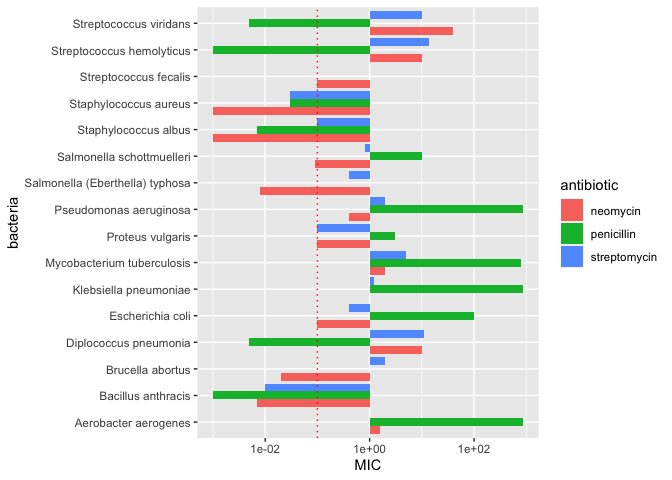

Antibiotics
================
An Grocki
2023-3-5

*Purpose*: Creating effective data visualizations is an *iterative*
process; very rarely will the first graph you make be the most
effective. The most effective thing you can do to be successful in this
iterative process is to *try multiple graphs* of the same data.

Furthermore, judging the effectiveness of a visual is completely
dependent on *the question you are trying to answer*. A visual that is
totally ineffective for one question may be perfect for answering a
different question.

In this challenge, you will practice *iterating* on data visualization,
and will anchor the *assessment* of your visuals using two different
questions.

*Note*: Please complete your initial visual design **alone**. Work on
both of your graphs alone, and save a version to your repo *before*
coming together with your team. This way you can all bring a diversity
of ideas to the table!

<!-- include-rubric -->

# Grading Rubric

<!-- -------------------------------------------------- -->

Unlike exercises, **challenges will be graded**. The following rubrics
define how you will be graded, both on an individual and team basis.

## Individual

<!-- ------------------------- -->

| Category    | Needs Improvement                                                                                                | Satisfactory                                                                                                               |
|-------------|------------------------------------------------------------------------------------------------------------------|----------------------------------------------------------------------------------------------------------------------------|
| Effort      | Some task **q**’s left unattempted                                                                               | All task **q**’s attempted                                                                                                 |
| Observed    | Did not document observations, or observations incorrect                                                         | Documented correct observations based on analysis                                                                          |
| Supported   | Some observations not clearly supported by analysis                                                              | All observations clearly supported by analysis (table, graph, etc.)                                                        |
| Assessed    | Observations include claims not supported by the data, or reflect a level of certainty not warranted by the data | Observations are appropriately qualified by the quality & relevance of the data and (in)conclusiveness of the support      |
| Specified   | Uses the phrase “more data are necessary” without clarification                                                  | Any statement that “more data are necessary” specifies which *specific* data are needed to answer what *specific* question |
| Code Styled | Violations of the [style guide](https://style.tidyverse.org/) hinder readability                                 | Code sufficiently close to the [style guide](https://style.tidyverse.org/)                                                 |

## Due Date

<!-- ------------------------- -->

All the deliverables stated in the rubrics above are due **at midnight**
before the day of the class discussion of the challenge. See the
[Syllabus](https://docs.google.com/document/d/1qeP6DUS8Djq_A0HMllMqsSqX3a9dbcx1/edit?usp=sharing&ouid=110386251748498665069&rtpof=true&sd=true)
for more information.

``` r
library(tidyverse)
```

    ## ── Attaching packages ─────────────────────────────────────── tidyverse 1.3.2 ──
    ## ✔ ggplot2 3.4.0      ✔ purrr   1.0.1 
    ## ✔ tibble  3.1.8      ✔ dplyr   1.0.10
    ## ✔ tidyr   1.2.1      ✔ stringr 1.5.0 
    ## ✔ readr   2.1.3      ✔ forcats 0.5.2 
    ## ── Conflicts ────────────────────────────────────────── tidyverse_conflicts() ──
    ## ✖ dplyr::filter() masks stats::filter()
    ## ✖ dplyr::lag()    masks stats::lag()

``` r
library(ggrepel)
```

*Background*: The data\[1\] we study in this challenge report the
[*minimum inhibitory
concentration*](https://en.wikipedia.org/wiki/Minimum_inhibitory_concentration)
(MIC) of three drugs for different bacteria. The smaller the MIC for a
given drug and bacteria pair, the more practical the drug is for
treating that particular bacteria. An MIC value of *at most* 0.1 is
considered necessary for treating human patients.

These data report MIC values for three antibiotics—penicillin,
streptomycin, and neomycin—on 16 bacteria. Bacteria are categorized into
a genus based on a number of features, including their resistance to
antibiotics.

``` r
## NOTE: If you extracted all challenges to the same location,
## you shouldn't have to change this filename
filename <- "./data/antibiotics.csv"

## Load the data
df_antibiotics <- read_csv(filename)
```

    ## Rows: 16 Columns: 5
    ## ── Column specification ────────────────────────────────────────────────────────
    ## Delimiter: ","
    ## chr (2): bacteria, gram
    ## dbl (3): penicillin, streptomycin, neomycin
    ## 
    ## ℹ Use `spec()` to retrieve the full column specification for this data.
    ## ℹ Specify the column types or set `show_col_types = FALSE` to quiet this message.

``` r
df_antibiotics %>% knitr::kable()
```

| bacteria                        | penicillin | streptomycin | neomycin | gram     |
|:--------------------------------|-----------:|-------------:|---------:|:---------|
| Aerobacter aerogenes            |    870.000 |         1.00 |    1.600 | negative |
| Brucella abortus                |      1.000 |         2.00 |    0.020 | negative |
| Bacillus anthracis              |      0.001 |         0.01 |    0.007 | positive |
| Diplococcus pneumonia           |      0.005 |        11.00 |   10.000 | positive |
| Escherichia coli                |    100.000 |         0.40 |    0.100 | negative |
| Klebsiella pneumoniae           |    850.000 |         1.20 |    1.000 | negative |
| Mycobacterium tuberculosis      |    800.000 |         5.00 |    2.000 | negative |
| Proteus vulgaris                |      3.000 |         0.10 |    0.100 | negative |
| Pseudomonas aeruginosa          |    850.000 |         2.00 |    0.400 | negative |
| Salmonella (Eberthella) typhosa |      1.000 |         0.40 |    0.008 | negative |
| Salmonella schottmuelleri       |     10.000 |         0.80 |    0.090 | negative |
| Staphylococcus albus            |      0.007 |         0.10 |    0.001 | positive |
| Staphylococcus aureus           |      0.030 |         0.03 |    0.001 | positive |
| Streptococcus fecalis           |      1.000 |         1.00 |    0.100 | positive |
| Streptococcus hemolyticus       |      0.001 |        14.00 |   10.000 | positive |
| Streptococcus viridans          |      0.005 |        10.00 |   40.000 | positive |

# Visualization

<!-- -------------------------------------------------- -->

### **q1** Prototype 5 visuals

To start, construct **5 qualitatively different visualizations of the
data** `df_antibiotics`. These **cannot** be simple variations on the
same graph; for instance, if two of your visuals could be made identical
by calling `coord_flip()`, then these are *not* qualitatively different.

For all five of the visuals, you must show information on *all 16
bacteria*. For the first two visuals, you must *show all variables*.

*Hint 1*: Try working quickly on this part; come up with a bunch of
ideas, and don’t fixate on any one idea for too long. You will have a
chance to refine later in this challenge.

*Hint 2*: The data `df_antibiotics` are in a *wide* format; it may be
helpful to `pivot_longer()` the data to make certain visuals easier to
construct.

#### Visual 1 (All variables)

In this visual you must show *all three* effectiveness values for *all
16 bacteria*. You must also show whether or not each bacterium is Gram
positive or negative.

``` r
#Understand and format data
glimpse(df_antibiotics)
```

    ## Rows: 16
    ## Columns: 5
    ## $ bacteria     <chr> "Aerobacter aerogenes", "Brucella abortus", "Bacillus ant…
    ## $ penicillin   <dbl> 870.000, 1.000, 0.001, 0.005, 100.000, 850.000, 800.000, …
    ## $ streptomycin <dbl> 1.00, 2.00, 0.01, 11.00, 0.40, 1.20, 5.00, 0.10, 2.00, 0.…
    ## $ neomycin     <dbl> 1.600, 0.020, 0.007, 10.000, 0.100, 1.000, 2.000, 0.100, …
    ## $ gram         <chr> "negative", "negative", "positive", "positive", "negative…

``` r
summary(df_antibiotics)
```

    ##    bacteria           penicillin        streptomycin       neomycin     
    ##  Length:16          Min.   :  0.0010   Min.   : 0.010   Min.   : 0.001  
    ##  Class :character   1st Qu.:  0.0065   1st Qu.: 0.325   1st Qu.: 0.017  
    ##  Mode  :character   Median :  1.0000   Median : 1.000   Median : 0.100  
    ##                     Mean   :217.8781   Mean   : 3.065   Mean   : 4.089  
    ##                     3rd Qu.:275.0000   3rd Qu.: 2.750   3rd Qu.: 1.700  
    ##                     Max.   :870.0000   Max.   :14.000   Max.   :40.000  
    ##      gram          
    ##  Length:16         
    ##  Class :character  
    ##  Mode  :character  
    ##                    
    ##                    
    ## 

``` r
df_antibiotics_long <- df_antibiotics %>% 
  pivot_longer(
    names_to = "antibiotic",
    values_to = "MIC",
    cols = ends_with("in")
  )
glimpse(df_antibiotics_long)
```

    ## Rows: 48
    ## Columns: 4
    ## $ bacteria   <chr> "Aerobacter aerogenes", "Aerobacter aerogenes", "Aerobacter…
    ## $ gram       <chr> "negative", "negative", "negative", "negative", "negative",…
    ## $ antibiotic <chr> "penicillin", "streptomycin", "neomycin", "penicillin", "st…
    ## $ MIC        <dbl> 870.000, 1.000, 1.600, 1.000, 2.000, 0.020, 0.001, 0.010, 0…

``` r
summary(df_antibiotics_long)
```

    ##    bacteria             gram            antibiotic             MIC         
    ##  Length:48          Length:48          Length:48          Min.   :  0.001  
    ##  Class :character   Class :character   Class :character   1st Qu.:  0.030  
    ##  Mode  :character   Mode  :character   Mode  :character   Median :  1.000  
    ##                                                           Mean   : 75.011  
    ##                                                           3rd Qu.:  6.250  
    ##                                                           Max.   :870.000

``` r
df_antibiotics_long %>% knitr::kable()
```

| bacteria                        | gram     | antibiotic   |     MIC |
|:--------------------------------|:---------|:-------------|--------:|
| Aerobacter aerogenes            | negative | penicillin   | 870.000 |
| Aerobacter aerogenes            | negative | streptomycin |   1.000 |
| Aerobacter aerogenes            | negative | neomycin     |   1.600 |
| Brucella abortus                | negative | penicillin   |   1.000 |
| Brucella abortus                | negative | streptomycin |   2.000 |
| Brucella abortus                | negative | neomycin     |   0.020 |
| Bacillus anthracis              | positive | penicillin   |   0.001 |
| Bacillus anthracis              | positive | streptomycin |   0.010 |
| Bacillus anthracis              | positive | neomycin     |   0.007 |
| Diplococcus pneumonia           | positive | penicillin   |   0.005 |
| Diplococcus pneumonia           | positive | streptomycin |  11.000 |
| Diplococcus pneumonia           | positive | neomycin     |  10.000 |
| Escherichia coli                | negative | penicillin   | 100.000 |
| Escherichia coli                | negative | streptomycin |   0.400 |
| Escherichia coli                | negative | neomycin     |   0.100 |
| Klebsiella pneumoniae           | negative | penicillin   | 850.000 |
| Klebsiella pneumoniae           | negative | streptomycin |   1.200 |
| Klebsiella pneumoniae           | negative | neomycin     |   1.000 |
| Mycobacterium tuberculosis      | negative | penicillin   | 800.000 |
| Mycobacterium tuberculosis      | negative | streptomycin |   5.000 |
| Mycobacterium tuberculosis      | negative | neomycin     |   2.000 |
| Proteus vulgaris                | negative | penicillin   |   3.000 |
| Proteus vulgaris                | negative | streptomycin |   0.100 |
| Proteus vulgaris                | negative | neomycin     |   0.100 |
| Pseudomonas aeruginosa          | negative | penicillin   | 850.000 |
| Pseudomonas aeruginosa          | negative | streptomycin |   2.000 |
| Pseudomonas aeruginosa          | negative | neomycin     |   0.400 |
| Salmonella (Eberthella) typhosa | negative | penicillin   |   1.000 |
| Salmonella (Eberthella) typhosa | negative | streptomycin |   0.400 |
| Salmonella (Eberthella) typhosa | negative | neomycin     |   0.008 |
| Salmonella schottmuelleri       | negative | penicillin   |  10.000 |
| Salmonella schottmuelleri       | negative | streptomycin |   0.800 |
| Salmonella schottmuelleri       | negative | neomycin     |   0.090 |
| Staphylococcus albus            | positive | penicillin   |   0.007 |
| Staphylococcus albus            | positive | streptomycin |   0.100 |
| Staphylococcus albus            | positive | neomycin     |   0.001 |
| Staphylococcus aureus           | positive | penicillin   |   0.030 |
| Staphylococcus aureus           | positive | streptomycin |   0.030 |
| Staphylococcus aureus           | positive | neomycin     |   0.001 |
| Streptococcus fecalis           | positive | penicillin   |   1.000 |
| Streptococcus fecalis           | positive | streptomycin |   1.000 |
| Streptococcus fecalis           | positive | neomycin     |   0.100 |
| Streptococcus hemolyticus       | positive | penicillin   |   0.001 |
| Streptococcus hemolyticus       | positive | streptomycin |  14.000 |
| Streptococcus hemolyticus       | positive | neomycin     |  10.000 |
| Streptococcus viridans          | positive | penicillin   |   0.005 |
| Streptococcus viridans          | positive | streptomycin |  10.000 |
| Streptococcus viridans          | positive | neomycin     |  40.000 |

``` r
#Visual 1
df_antibiotics_long %>% 
  ggplot(aes(antibiotic, MIC)) +
  geom_boxplot() + 
  geom_point(mapping = aes(color = bacteria, shape = gram)) +
  geom_hline(
    yintercept = 0.1,
    linetype = "dotted",
    color = "red"
  ) +
  scale_y_log10() 
```

<!-- -->

#### Visual 2 (All variables)

In this visual you must show *all three* effectiveness values for *all
16 bacteria*. You must also show whether or not each bacterium is Gram
positive or negative.

Note that your visual must be *qualitatively different* from *all* of
your other visuals.

``` r
# WRITE YOUR CODE HERE
df_antibiotics_long %>% 
  ggplot(aes( MIC, antibiotic, fill = gram )) + 
  geom_col()+
  facet_wrap(~bacteria, scales = "free_x") +
  geom_vline(
    xintercept = 0.1,
    linetype = "dotted",
    color = "red"
  ) 
```

<!-- -->

#### Visual 3 (Some variables)

In this visual you may show a *subset* of the variables (`penicillin`,
`streptomycin`, `neomycin`, `gram`), but you must still show *all 16
bacteria*.

Note that your visual must be *qualitatively different* from *all* of
your other visuals.

``` r
# WRITE YOUR CODE HERE
df_antibiotics%>% 
  ggplot(aes( penicillin,streptomycin, shape = gram )) + 
  geom_point(mapping = aes(color = bacteria)) +
  geom_hline(
    yintercept = 0.1,
    linetype = "dotted",
    color = "red"
  ) +
  geom_vline(
    xintercept = 0.1,
    linetype = "dotted",
    color = "red"
  ) +
  scale_y_log10() +
  scale_x_log10()
```

<!-- -->

#### Visual 4 (Some variables)

In this visual you may show a *subset* of the variables (`penicillin`,
`streptomycin`, `neomycin`, `gram`), but you must still show *all 16
bacteria*.

Note that your visual must be *qualitatively different* from *all* of
your other visuals.

``` r
df_antibiotics_long %>% 
  ggplot(aes(MIC, bacteria)) +
  geom_col(mapping = aes(fill = antibiotic)) + 
  scale_x_log10()+
  geom_vline(
    xintercept = 0.1,
    linetype = "dotted",
    color = "red"
  ) 
```

<!-- -->

#### Visual 5 (Some variables)

In this visual you may show a *subset* of the variables (`penicillin`,
`streptomycin`, `neomycin`, `gram`), but you must still show *all 16
bacteria*.

Note that your visual must be *qualitatively different* from *all* of
your other visuals.

``` r
df_antibiotics_long %>% 
  ggplot(aes( gram, MIC)) +
  geom_violin() + 
  geom_point(mapping = aes(color = bacteria)) +
  geom_hline(
    yintercept = 0.1,
    linetype = "dotted",
    color = "red"
  ) +
  facet_wrap(~ antibiotic) +
  scale_y_log10() 
```

<!-- -->

### **q2** Assess your visuals

There are **two questions** below; use your five visuals to help answer
both Guiding Questions. Note that you must also identify which of your
five visuals were most helpful in answering the questions.

*Hint 1*: It’s possible that *none* of your visuals is effective in
answering the questions below. You may need to revise one or more of
your visuals to answer the questions below!

*Hint 2*: It’s **highly unlikely** that the same visual is the most
effective at helping answer both guiding questions. **Use this as an
opportunity to think about why this is.**

#### Guiding Question 1

> How do the three antibiotics vary in their effectiveness against
> bacteria of different genera and Gram stain?

*Observations*

\- What is your response to the question above?

\- Penicillin is only effective with positive gram bacteria.
Streptomycin is effective with at most one negative gram bacteria and
some positive gram bacteria. Neomycin is effective with the largest
range of bacteria that includes both negative and positive bacteria. All
three antibiotics are effective against staphylococcus aureus, but
neomcycin requires the smallest concentrations, with penicillin and
streptomycin requiring around the same amount.

- Which of your visuals above (1 through 5) is **most effective** at
  helping to answer this question?

\- Visual 5

Why?

- It showed all the variables in clear way that I could understand and
  synthesize. The large shape of violin graph made it easier to see
  general trends as opposed to getting lost in the details. The red
  dashed line was a clear indicting of which antibiotics where effective
  since I only had to look at below the dashed line. I also think
  splitting it up into three graphs based on the antibiotics made it
  easy to compare between them, especially with a common scale for the
  MIC value. The split for positive vs negative gram was also easy to
  see.

#### Guiding Question 2

In 1974 *Diplococcus pneumoniae* was renamed *Streptococcus pneumoniae*,
and in 1984 *Streptococcus fecalis* was renamed *Enterococcus fecalis*
\[2\].

> Why was *Diplococcus pneumoniae* was renamed *Streptococcus
> pneumoniae*?

*Observations*

\- What is your response to the question above?

\- Diplococcus pneumoniae was renamed to Streptococcus pneumonia because
it requires a high streptomycin MIC value at around 10. Furthermore,
other Streptococcus named bacteria also had a large MIC value that
ranges from 1 to around 15.

\- Which of your visuals above (1 through 5) is **most effective** at
helping to answer this question?

\- Visual 2 was most helpful.

-Why?

\- The names of each bacteria was labeled very large and clear at the
top of each graph, so I could quickly glance over the names and find
Diplococcus pneumoniae and other strep named bacteria. Moreover, it was
easy to read the MIC value of each bacteria for streptomycin because the
scales were different for each bacteria.

# References

<!-- -------------------------------------------------- -->

\[1\] Neomycin in skin infections: A new topical antibiotic with wide
antibacterial range and rarely sensitizing. Scope. 1951;3(5):4-7.

\[2\] Wainer and Lysen, “That’s Funny…” *American Scientist* (2009)
[link](https://www.americanscientist.org/article/thats-funny)
