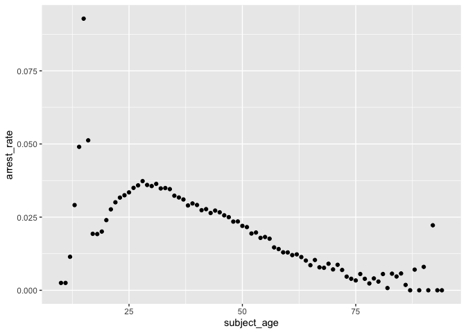
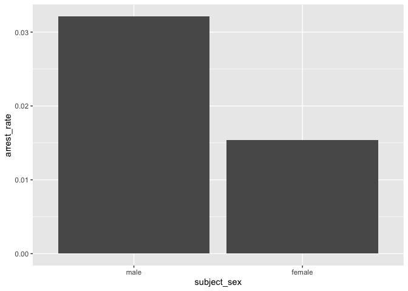
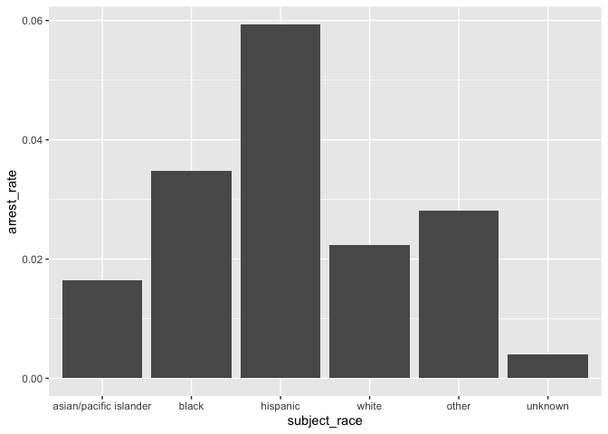
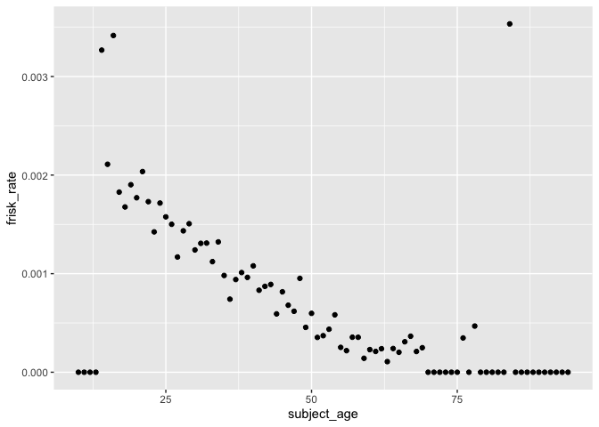
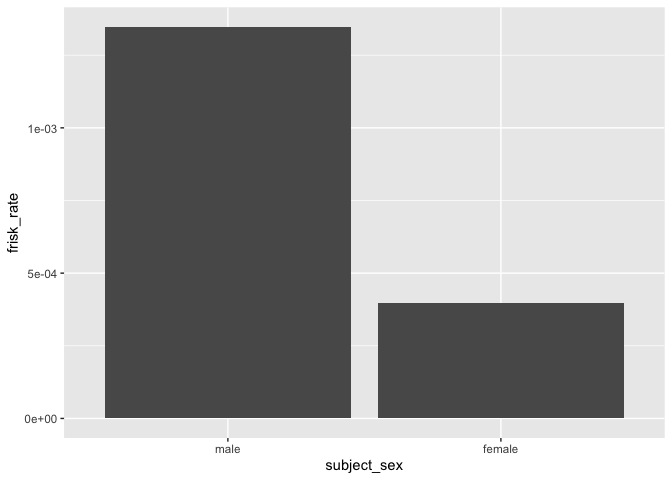
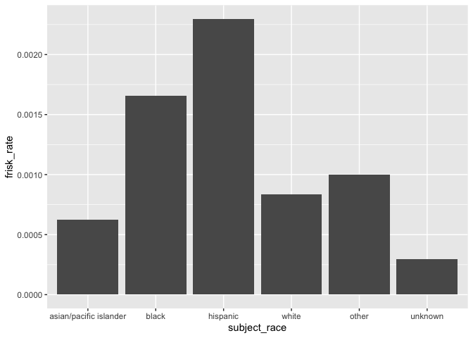

Massachusetts Highway Stops
================
An Grocki
2022-05-02

- <a href="#grading-rubric" id="toc-grading-rubric">Grading Rubric</a>
  - <a href="#individual" id="toc-individual">Individual</a>
  - <a href="#due-date" id="toc-due-date">Due Date</a>
- <a href="#setup" id="toc-setup">Setup</a>
  - <a
    href="#q1-go-to-the-stanford-open-policing-project-page-and-download-the-massachusetts-state-police-records-in-rds-format-move-the-data-to-your-data-folder-and-match-the-filename-to-load-the-data"
    id="toc-q1-go-to-the-stanford-open-policing-project-page-and-download-the-massachusetts-state-police-records-in-rds-format-move-the-data-to-your-data-folder-and-match-the-filename-to-load-the-data"><strong>q1</strong>
    Go to the Stanford Open Policing Project page and download the
    Massachusetts State Police records in <code>Rds</code> format. Move the
    data to your <code>data</code> folder and match the
    <code>filename</code> to load the data.</a>
- <a href="#eda" id="toc-eda">EDA</a>
  - <a
    href="#q2-do-your-first-checks-on-the-dataset-what-are-the-basic-facts-about-this-dataset"
    id="toc-q2-do-your-first-checks-on-the-dataset-what-are-the-basic-facts-about-this-dataset"><strong>q2</strong>
    Do your “first checks” on the dataset. What are the basic facts about
    this dataset?</a>
  - <a
    href="#q3-check-the-set-of-factor-levels-for-subject_race-and-raw_race-what-do-you-note-about-overlap--difference-between-the-two-sets"
    id="toc-q3-check-the-set-of-factor-levels-for-subject_race-and-raw_race-what-do-you-note-about-overlap--difference-between-the-two-sets"><strong>q3</strong>
    Check the set of factor levels for <code>subject_race</code> and
    <code>raw_Race</code>. What do you note about overlap / difference
    between the two sets?</a>
  - <a
    href="#q4-check-whether-subject_race-and-raw_race-match-for-a-large-fraction-of-cases-which-of-the-two-hypotheses-above-is-most-likely-based-on-your-results"
    id="toc-q4-check-whether-subject_race-and-raw_race-match-for-a-large-fraction-of-cases-which-of-the-two-hypotheses-above-is-most-likely-based-on-your-results"><strong>q4</strong>
    Check whether <code>subject_race</code> and <code>raw_Race</code> match
    for a large fraction of cases. Which of the two hypotheses above is most
    likely, based on your results?</a>
  - <a href="#vis" id="toc-vis">Vis</a>
    - <a
      href="#q5-compare-the-arrest-ratethe-fraction-of-total-cases-in-which-the-subject-was-arrestedacross-different-factors-create-as-many-visuals-or-tables-as-you-need-but-make-sure-to-check-the-trends-across-all-of-the-subject-variables-answer-the-questions-under-observations-below"
      id="toc-q5-compare-the-arrest-ratethe-fraction-of-total-cases-in-which-the-subject-was-arrestedacross-different-factors-create-as-many-visuals-or-tables-as-you-need-but-make-sure-to-check-the-trends-across-all-of-the-subject-variables-answer-the-questions-under-observations-below"><strong>q5</strong>
      Compare the <em>arrest rate</em>—the fraction of total cases in which
      the subject was arrested—across different factors. Create as many
      visuals (or tables) as you need, but make sure to check the trends
      across all of the <code>subject</code> variables. Answer the questions
      under <em>observations</em> below.</a>
- <a href="#modeling" id="toc-modeling">Modeling</a>
  - <a
    href="#q6-run-the-following-code-and-interpret-the-regression-coefficients-answer-the-the-questions-under-observations-below"
    id="toc-q6-run-the-following-code-and-interpret-the-regression-coefficients-answer-the-the-questions-under-observations-below"><strong>q6</strong>
    Run the following code and interpret the regression coefficients. Answer
    the the questions under <em>observations</em> below.</a>
  - <a
    href="#q7-re-fit-the-logistic-regression-from-q6-setting-white-as-the-reference-level-for-subject_race-interpret-the-the-model-terms-and-answer-the-questions-below"
    id="toc-q7-re-fit-the-logistic-regression-from-q6-setting-white-as-the-reference-level-for-subject_race-interpret-the-the-model-terms-and-answer-the-questions-below"><strong>q7</strong>
    Re-fit the logistic regression from q6 setting <code>"white"</code> as
    the reference level for <code>subject_race</code>. Interpret the the
    model terms and answer the questions below.</a>
  - <a
    href="#q8-re-fit-the-model-using-a-factor-indicating-the-presence-of-contraband-in-the-subjects-vehicle-answer-the-questions-under-observations-below"
    id="toc-q8-re-fit-the-model-using-a-factor-indicating-the-presence-of-contraband-in-the-subjects-vehicle-answer-the-questions-under-observations-below"><strong>q8</strong>
    Re-fit the model using a factor indicating the presence of contraband in
    the subject’s vehicle. Answer the questions under <em>observations</em>
    below.</a>
  - <a
    href="#q9-go-deeper-pose-at-least-one-more-question-about-the-data-and-fit-at-least-one-more-model-in-support-of-answering-that-question"
    id="toc-q9-go-deeper-pose-at-least-one-more-question-about-the-data-and-fit-at-least-one-more-model-in-support-of-answering-that-question"><strong>q9</strong>
    Go deeper: Pose at least one more question about the data and fit at
    least one more model in support of answering that question.</a>

*Purpose*: In this last challenge we’ll focus on using logistic
regression to study a large, complicated dataset. Interpreting the
results of a model can be challenging—both in terms of the statistics
and the real-world reasoning—so we’ll get some practice in this
challenge.

<!-- include-rubric -->

# Grading Rubric

<!-- -------------------------------------------------- -->

Unlike exercises, **challenges will be graded**. The following rubrics
define how you will be graded, both on an individual and team basis.

## Individual

<!-- ------------------------- -->

| Category    | Needs Improvement                                                                                                | Satisfactory                                                                                                               |
|-------------|------------------------------------------------------------------------------------------------------------------|----------------------------------------------------------------------------------------------------------------------------|
| Effort      | Some task **q**’s left unattempted                                                                               | All task **q**’s attempted                                                                                                 |
| Observed    | Did not document observations, or observations incorrect                                                         | Documented correct observations based on analysis                                                                          |
| Supported   | Some observations not clearly supported by analysis                                                              | All observations clearly supported by analysis (table, graph, etc.)                                                        |
| Assessed    | Observations include claims not supported by the data, or reflect a level of certainty not warranted by the data | Observations are appropriately qualified by the quality & relevance of the data and (in)conclusiveness of the support      |
| Specified   | Uses the phrase “more data are necessary” without clarification                                                  | Any statement that “more data are necessary” specifies which *specific* data are needed to answer what *specific* question |
| Code Styled | Violations of the [style guide](https://style.tidyverse.org/) hinder readability                                 | Code sufficiently close to the [style guide](https://style.tidyverse.org/)                                                 |

## Due Date

<!-- ------------------------- -->

All the deliverables stated in the rubrics above are due **at midnight**
before the day of the class discussion of the challenge. See the
[Syllabus](https://docs.google.com/document/d/1qeP6DUS8Djq_A0HMllMqsSqX3a9dbcx1/edit?usp=sharing&ouid=110386251748498665069&rtpof=true&sd=true)
for more information.

*Background*: We’ll study data from the [Stanford Open Policing
Project](https://openpolicing.stanford.edu/data/), specifically their
dataset on Massachusetts State Patrol police stops.

``` r
library(tidyverse)
```

    ## ── Attaching packages ─────────────────────────────────────── tidyverse 1.3.2 ──
    ## ✔ ggplot2 3.4.0      ✔ purrr   1.0.1 
    ## ✔ tibble  3.1.8      ✔ dplyr   1.0.10
    ## ✔ tidyr   1.2.1      ✔ stringr 1.5.0 
    ## ✔ readr   2.1.3      ✔ forcats 0.5.2 
    ## ── Conflicts ────────────────────────────────────────── tidyverse_conflicts() ──
    ## ✖ dplyr::filter() masks stats::filter()
    ## ✖ dplyr::lag()    masks stats::lag()

``` r
library(broom)
```

# Setup

<!-- -------------------------------------------------- -->

### **q1** Go to the [Stanford Open Policing Project](https://openpolicing.stanford.edu/data/) page and download the Massachusetts State Police records in `Rds` format. Move the data to your `data` folder and match the `filename` to load the data.

*Note*: An `Rds` file is an R-specific file format. The function
`readRDS` will read these files.

``` r
## TODO: Download the data, move to your data folder, and load it
filename <- "data/ma_statewide_2020_04_01.rds"
df_data <- readRDS(filename)
```

# EDA

<!-- -------------------------------------------------- -->

### **q2** Do your “first checks” on the dataset. What are the basic facts about this dataset?

``` r
summary(df_data)
```

    ##  raw_row_number          date              location         county_name       
    ##  Length:3416238     Min.   :2007-01-01   Length:3416238     Length:3416238    
    ##  Class :character   1st Qu.:2009-04-22   Class :character   Class :character  
    ##  Mode  :character   Median :2011-07-08   Mode  :character   Mode  :character  
    ##                     Mean   :2011-07-16                                        
    ##                     3rd Qu.:2013-08-27                                        
    ##                     Max.   :2015-12-31                                        
    ##                                                                               
    ##   subject_age                     subject_race     subject_sex     
    ##  Min.   :10.00    asian/pacific islander: 166842   male  :2362238  
    ##  1st Qu.:25.00    black                 : 351610   female:1038377  
    ##  Median :34.00    hispanic              : 338317   NA's  :  15623  
    ##  Mean   :36.47    white                 :2529780                   
    ##  3rd Qu.:46.00    other                 :  11008                   
    ##  Max.   :94.00    unknown               :  17017                   
    ##  NA's   :158006   NA's                  :   1664                   
    ##          type         arrest_made     citation_issued warning_issued 
    ##  pedestrian:      0   Mode :logical   Mode :logical   Mode :logical  
    ##  vehicular :3416238   FALSE:3323303   FALSE:1244039   FALSE:2269244  
    ##                       TRUE :92019     TRUE :2171283   TRUE :1146078  
    ##                       NA's :916       NA's :916       NA's :916      
    ##                                                                      
    ##                                                                      
    ##                                                                      
    ##      outcome        contraband_found contraband_drugs contraband_weapons
    ##  warning :1146078   Mode :logical    Mode :logical    Mode :logical     
    ##  citation:2171283   FALSE:28256      FALSE:36296      FALSE:53237       
    ##  summons :      0   TRUE :27474      TRUE :19434      TRUE :2493        
    ##  arrest  :  92019   NA's :3360508    NA's :3360508    NA's :3360508     
    ##  NA's    :   6858                                                       
    ##                                                                         
    ##                                                                         
    ##  contraband_alcohol contraband_other frisk_performed search_conducted
    ##  Mode :logical      Mode :logical    Mode :logical   Mode :logical   
    ##  FALSE:3400070      FALSE:51708      FALSE:51029     FALSE:3360508   
    ##  TRUE :16168        TRUE :4022       TRUE :3602      TRUE :55730     
    ##                     NA's :3360508    NA's :3361607                   
    ##                                                                      
    ##                                                                      
    ##                                                                      
    ##          search_basis     reason_for_stop    vehicle_type      
    ##  k9            :      0   Length:3416238     Length:3416238    
    ##  plain view    :      0   Class :character   Class :character  
    ##  consent       :   6903   Mode  :character   Mode  :character  
    ##  probable cause:  25898                                        
    ##  other         :  18228                                        
    ##  NA's          :3365209                                        
    ##                                                                
    ##  vehicle_registration_state   raw_Race        
    ##  MA     :3053713            Length:3416238    
    ##  CT     :  82906            Class :character  
    ##  NY     :  69059            Mode  :character  
    ##  NH     :  51514                              
    ##  RI     :  39375                              
    ##  (Other): 109857                              
    ##  NA's   :   9814

Note that we have both a `subject_race` and `race_Raw` column. There are
a few possibilities as to what `race_Raw` represents:

- `race_Raw` could be the race of the police officer in the stop
- `race_Raw` could be an unprocessed version of `subject_race`

Let’s try to distinguish between these two possibilities.

### **q3** Check the set of factor levels for `subject_race` and `raw_Race`. What do you note about overlap / difference between the two sets?

``` r
## TODO: Determine the factor levels for subject_race and raw_Race
df_data %>% 
  pull(subject_race) %>% 
  unique()
```

    ## [1] white                  hispanic               black                 
    ## [4] asian/pacific islander other                  <NA>                  
    ## [7] unknown               
    ## Levels: asian/pacific islander black hispanic white other unknown

``` r
df_data %>% 
  pull(raw_Race) %>% 
  unique()
```

    ## [1] "White"                                        
    ## [2] "Hispanic"                                     
    ## [3] "Black"                                        
    ## [4] "Asian or Pacific Islander"                    
    ## [5] "Middle Eastern or East Indian (South Asian)"  
    ## [6] "American Indian or Alaskan Native"            
    ## [7] NA                                             
    ## [8] "None - for no operator present citations only"
    ## [9] "A"

**Observations**:

- What are the unique values for `subject_race`?
  - White, Hispanic, Black, Asian/Pacific Islander, other, NA, unknown
- What are the unique values for `raw_Race`?
  - White, Hispanic, Black, Asian or Pacific Islander, Middle Eastern or
    East Indian(South Asian), American Indian or Alaskan Native, NA,
    None - for no operator present citations only, A
- What is the overlap between the two sets?
  - White, Hispanic, Black, Asian or Pacific islander, NA
- What is the difference between the two sets?
  - Other, unknown
  - Middle Eastern or East Indian(South Asian), American Indian or
    Alaskan Native, None - for no operator present citations only, A

### **q4** Check whether `subject_race` and `raw_Race` match for a large fraction of cases. Which of the two hypotheses above is most likely, based on your results?

*Note*: Just to be clear, I’m *not* asking you to do a *statistical*
hypothesis test.

``` r
## TODO: Devise your own way to test the hypothesis posed above.
orginal <- df_data %>% nrow()
matched <- df_data %>% 
  filter(
    is.na(subject_race) & is.na(raw_Race) |
  (subject_race == "white" & raw_Race == "White") |
  (subject_race == "hispanic" & raw_Race == "Hispanic") |
  (subject_race == "black" & raw_Race == "Black") |
  (subject_race == "asian/pacific islander" & raw_Race == "Asian or Pacific Islander")) %>% 
    nrow()
fraction <- matched/orginal
fraction
```

    ## [1] 0.9729015

**Observations**

Between the two hypotheses:

- `race_Raw` could be the race of the police officer in the stop
- `race_Raw` could be an unprocessed version of `subject_race`

which is most plausible, based on your results?

- It is most plausible that race_Raw is the unprocessed version of
  subject race since 97 percent of cases match the overlapping values
  between race_Raw and subject_race.

## Vis

<!-- ------------------------- -->

### **q5** Compare the *arrest rate*—the fraction of total cases in which the subject was arrested—across different factors. Create as many visuals (or tables) as you need, but make sure to check the trends across all of the `subject` variables. Answer the questions under *observations* below.

(Note: Create as many chunks and visuals as you need)

``` r
# rate by age
df_data %>% 
  drop_na(subject_age) %>% 
  group_by(subject_age) %>%
  summarize(
    num = n(),
    arrest_count = sum(!is.na(arrest_made) & arrest_made == TRUE),
    arrest_rate = arrest_count / num
  ) %>% 
  ggplot(aes(subject_age, arrest_rate)) +
  geom_point()
```

<!-- -->

``` r
df_data %>% 
  drop_na(subject_age) %>% 
  group_by(subject_age) %>%
  summarize(
    num = n(),
    arrest_count = sum(!is.na(arrest_made) & arrest_made == TRUE),
    arrest_rate = arrest_count / num
  ) %>% 
  filter(arrest_rate > .05)
```

    ## # A tibble: 2 × 4
    ##   subject_age   num arrest_count arrest_rate
    ##         <int> <int>        <int>       <dbl>
    ## 1          15   474           44      0.0928
    ## 2          16  2049          105      0.0512

``` r
# rate by sex
df_data %>% 
  drop_na(subject_sex) %>% 
  group_by(subject_sex) %>%
  summarize(
    num = n(),
    arrest_count = sum(!is.na(arrest_made) & arrest_made == TRUE),
    arrest_rate = arrest_count / num
  ) %>% 
  ggplot() +
  geom_bar(aes(x = subject_sex, y = arrest_rate), stat = "identity")
```

<!-- -->

``` r
#rate by race 
df_data %>% 
  drop_na(subject_race) %>% 
  group_by(subject_race) %>%
  summarize(
    num = n(),
    arrest_count = sum(!is.na(arrest_made) & arrest_made == TRUE),
    arrest_rate = arrest_count / num
  ) %>% 
  ggplot() +
  geom_bar(aes(x = subject_race, y = arrest_rate), stat = "identity")
```

<!-- -->

**Observations**:

- How does `arrest_rate` tend to vary with `subject_age`?
  - The arrest rate has a quick spike at 16, before going down then
    steadily increasing until around 26 before decreasing as the
    subject’s age increases.
- How does `arrest_rate` tend to vary with `subject_sex`?
  - Mens arrest rate is almost twice as a females arrest rates.
- How does `arrest_rate` tend to vary with `subject_race`?
  - Hispanics have significantly higher arrest rates then other races.
  - Hispanic \> black \> other \> white \> Asian \> unknown

# Modeling

<!-- -------------------------------------------------- -->

We’re going to use a model to study the relationship between `subject`
factors and arrest rate, but first we need to understand a bit more
about *dummy variables*

### **q6** Run the following code and interpret the regression coefficients. Answer the the questions under *observations* below.

``` r
## NOTE: No need to edit; inspect the estimated model terms.
fit_q6 <-
  glm(
    formula = arrest_made ~ subject_age + subject_race + subject_sex,
    data = df_data %>%
      filter(
        !is.na(arrest_made),
        subject_race %in% c("white", "black", "hispanic")
      ),
    family = "binomial"
  )

fit_q6 %>% tidy()
```

    ## # A tibble: 5 × 5
    ##   term                 estimate std.error statistic   p.value
    ##   <chr>                   <dbl>     <dbl>     <dbl>     <dbl>
    ## 1 (Intercept)           -2.67    0.0132      -202.  0        
    ## 2 subject_age           -0.0142  0.000280     -50.5 0        
    ## 3 subject_racehispanic   0.513   0.0119        43.3 0        
    ## 4 subject_racewhite     -0.380   0.0103       -37.0 3.12e-299
    ## 5 subject_sexfemale     -0.755   0.00910      -83.0 0

**Observations**:

- Which `subject_race` levels are included in fitting the model?
  - white, black, and Hispanic
- Which `subject_race` levels have terms in the model?
  - Hispanic and white

You should find that each factor in the model has a level *missing* in
its set of terms. This is because R represents factors against a
*reference level*: The model treats one factor level as “default”, and
each factor model term represents a change from that “default” behavior.
For instance, the model above treats `subject_sex==male` as the
reference level, so the `subject_sexfemale` term represents the *change
in probability* of arrest due to a person being female (rather than
male).

The this reference level approach to coding factors is necessary for
[technical
reasons](https://www.andrew.cmu.edu/user/achoulde/94842/lectures/lecture10/lecture10-94842.html#why-is-one-of-the-levels-missing-in-the-regression),
but it complicates interpreting the model results. For instance; if we
want to compare two levels, neither of which are the reference level, we
have to consider the difference in their model coefficients. But if we
want to compare all levels against one “baseline” level, then we can
relevel the data to facilitate this comparison.

By default `glm` uses the first factor level present as the reference
level. Therefore we can use
`mutate(factor = fct_relevel(factor, "desired_level"))` to set our
`"desired_level"` as the reference factor.

### **q7** Re-fit the logistic regression from q6 setting `"white"` as the reference level for `subject_race`. Interpret the the model terms and answer the questions below.

``` r
## TODO: Re-fit the logistic regression, but set "white" as the reference
## level for subject_race
fit_q7  <-
  glm(
    formula = arrest_made ~ subject_age + subject_race + subject_sex,
    data = df_data %>%
      filter(
        !is.na(arrest_made),
        subject_race %in% c("white", "black", "hispanic")
      ) %>% 
    mutate(subject_race = fct_relevel(subject_race, "white")),
    family = "binomial"
  )
fit_q7 %>% tidy()
```

    ## # A tibble: 5 × 5
    ##   term                 estimate std.error statistic   p.value
    ##   <chr>                   <dbl>     <dbl>     <dbl>     <dbl>
    ## 1 (Intercept)           -3.05    0.0109      -279.  0        
    ## 2 subject_age           -0.0142  0.000280     -50.5 0        
    ## 3 subject_raceblack      0.380   0.0103        37.0 3.12e-299
    ## 4 subject_racehispanic   0.893   0.00859      104.  0        
    ## 5 subject_sexfemale     -0.755   0.00910      -83.0 0

``` r
fit_q7
```

    ## 
    ## Call:  glm(formula = arrest_made ~ subject_age + subject_race + subject_sex, 
    ##     family = "binomial", data = df_data %>% filter(!is.na(arrest_made), 
    ##         subject_race %in% c("white", "black", "hispanic")) %>% 
    ##         mutate(subject_race = fct_relevel(subject_race, "white")))
    ## 
    ## Coefficients:
    ##          (Intercept)           subject_age     subject_raceblack  
    ##             -3.04937              -0.01416               0.37973  
    ## subject_racehispanic     subject_sexfemale  
    ##              0.89265              -0.75500  
    ## 
    ## Degrees of Freedom: 3082259 Total (i.e. Null);  3082255 Residual
    ##   (136596 observations deleted due to missingness)
    ## Null Deviance:       792500 
    ## Residual Deviance: 769500    AIC: 769500

**Observations**:

- Which `subject_race` level has the highest probability of being
  arrested, according to this model? Which has the lowest probability?
  - The highest rate is if the subject’s rate is Hispanic and the lowest
    rate is if the subjects race is white.
- What could explain this difference in probabilities of arrest across
  race? List **multiple** possibilities.
  - Racial Basis
  - Income/class differences
  - Race of the officer
- Look at the sent of variables in the dataset; do any of the columns
  relate to a potential explanation you listed?
  - Location
  - Reason for stop
  - Search conducted

One way we can explain differential arrest rates is to include some
measure indicating the presence of an arrestable offense. We’ll do this
in a particular way in the next task.

### **q8** Re-fit the model using a factor indicating the presence of contraband in the subject’s vehicle. Answer the questions under *observations* below.

``` r
## TODO: Repeat the modeling above, but control for whether contraband was found
## during the police stop
fit_q8  <-
  glm(
    formula = arrest_made ~ subject_age + subject_race + subject_sex + contraband_found,
    data = df_data %>%
      filter(
        !is.na(arrest_made),
        subject_race %in% c("white", "black", "hispanic")
      ) %>% 
    mutate(subject_race = fct_relevel(subject_race, "white")),
    family = "binomial"
  )
fit_q8 %>% tidy()
```

    ## # A tibble: 6 × 5
    ##   term                 estimate std.error statistic   p.value
    ##   <chr>                   <dbl>     <dbl>     <dbl>     <dbl>
    ## 1 (Intercept)           -1.72    0.0339      -50.8  0        
    ## 2 subject_age            0.0225  0.000866     26.0  2.19e-149
    ## 3 subject_raceblack     -0.0511  0.0270       -1.90 5.80e-  2
    ## 4 subject_racehispanic   0.221   0.0237        9.31 1.32e- 20
    ## 5 subject_sexfemale     -0.306   0.0257      -11.9  1.06e- 32
    ## 6 contraband_foundTRUE   0.609   0.0192       31.7  4.29e-221

**Observations**:

- How does controlling for found contraband affect the `subject_race`
  terms in the model?
  - The same pattern emerges where the subject’s more likely to get
    arrested if there race if there are Hispanic, then black, then white
    although at a significantly lower degrees.
- What does the *finding of contraband* tell us about the stop? What
  does it *not* tell us about the stop?
  - Finding a contraband tell us that the the police officer searched
    the car and that finding a contraband is a higher indicator of being
    arrested than race. The stop does not account for racial basis in
    the decision to search the car as well as ratios of the cars
    searched and not searched.

### **q9** Go deeper: Pose at least one more question about the data and fit at least one more model in support of answering that question.

- What factors increase the rates of someone being
  frisked?(<https://www.nytimes.com/2020/03/02/upshot/stop-and-frisk-bloomberg.html?smid=url-share>)

``` r
# rate by age
df_data %>% 
  drop_na(subject_age) %>% 
  group_by(subject_age) %>%
  summarize(
    num = n(),
    frisk_count = sum(!is.na(frisk_performed  ) & frisk_performed  == TRUE),
    frisk_rate = frisk_count / num
  ) %>% 
  ggplot(aes(subject_age, frisk_rate)) +
  geom_point()
```

<!-- -->

``` r
df_data %>% 
  drop_na(subject_age) %>% 
  group_by(subject_age) %>%
  summarize(
    num = n(),
    frisk_count = sum(!is.na(frisk_performed  ) & frisk_performed  == TRUE),
    frisk_rate = frisk_count / num
  ) %>% 
  filter(frisk_rate > .003)
```

    ## # A tibble: 3 × 4
    ##   subject_age   num frisk_count frisk_rate
    ##         <int> <int>       <int>      <dbl>
    ## 1          14   306           1    0.00327
    ## 2          16  2049           7    0.00342
    ## 3          84   849           3    0.00353

``` r
df_data %>% 
  drop_na(subject_age) %>% 
  group_by(subject_age) %>%
  summarize(
    num = n(),
    frisk_count = sum(!is.na(frisk_performed  ) & frisk_performed  == TRUE),
    frisk_rate = frisk_count / num
  ) %>% 
  filter(frisk_rate == 0)
```

    ## # A tibble: 26 × 4
    ##    subject_age   num frisk_count frisk_rate
    ##          <int> <int>       <int>      <dbl>
    ##  1          10   398           0          0
    ##  2          11   397           0          0
    ##  3          12   262           0          0
    ##  4          13   206           0          0
    ##  5          70  7005           0          0
    ##  6          71  5968           0          0
    ##  7          72  5040           0          0
    ##  8          73  4282           0          0
    ##  9          74  3812           0          0
    ## 10          75  3267           0          0
    ## # … with 16 more rows

``` r
df_data %>% pull(subject_age) %>% summary()
```

    ##    Min. 1st Qu.  Median    Mean 3rd Qu.    Max.    NA's 
    ##   10.00   25.00   34.00   36.47   46.00   94.00  158006

``` r
# rate by race
df_data %>% 
  drop_na(subject_sex) %>% 
  group_by(subject_sex) %>%
  summarize(
    num = n(),
    frisk_count = sum(!is.na(frisk_performed  ) & frisk_performed  == TRUE),
    frisk_rate = frisk_count / num
  ) %>% 
    ggplot() +
  geom_bar(aes(x = subject_sex, y = frisk_rate), stat = "identity")
```

<!-- -->

``` r
# rate by race
df_data %>% 
  drop_na(subject_race) %>% 
  group_by(subject_race) %>%
  summarize(
    num = n(),
    frisk_count = sum(!is.na(frisk_performed  ) & frisk_performed  == TRUE),
    frisk_rate = frisk_count / num
  ) %>% 
    ggplot() +
  geom_bar(aes(x = subject_race, y = frisk_rate), stat = "identity")
```

<!-- -->

``` r
fit_q9  <-
  glm(
    formula = frisk_performed ~ subject_age + subject_race + subject_sex,
    data = df_data %>%
      filter(
        !is.na(arrest_made),
        subject_race %in% c("white", "black", "hispanic")
      ) %>% 
    mutate(subject_race = fct_relevel(subject_race, "white")),
    family = "binomial"
  )
fit_q9 %>% tidy()
```

    ## # A tibble: 5 × 5
    ##   term                 estimate std.error statistic  p.value
    ##   <chr>                   <dbl>     <dbl>     <dbl>    <dbl>
    ## 1 (Intercept)          -2.50      0.0572     -43.7  0       
    ## 2 subject_age          -0.00330   0.00169     -1.95 5.07e- 2
    ## 3 subject_raceblack     0.0663    0.0488       1.36 1.74e- 1
    ## 4 subject_racehispanic  0.0815    0.0438       1.86 6.27e- 2
    ## 5 subject_sexfemale    -0.509     0.0547      -9.30 1.39e-20

**Observations**:

- Age
  - From 10-13, you are most likely not going to be frisked, but then it
    jumps from 14-16 before decreasing until you are 70 when you also
    tend not to get frisked. There is a odd outlair at 84 years old
    where the rate is as high as 14-16.
- Sex
  - Similar to the results with being arrested, men are almost 3x more
    likely to be frisked then women.
- Race
  - Race is also similar the results from being arrested, although both
    Hispanic and black are significantly higher.
  - Hispanic \> Black \> Other \> White \> Asian / Pacific Islander \>
    unknown
- Model
  - Based on the model, being white has the lowest probability of being
    frisked then women while being Hispanic has the highest probability
    of being frisked then being black.

<!-- -------------------------------------------------- -->

- Stanford Open Policing Project
  [findings](https://openpolicing.stanford.edu/findings/).
